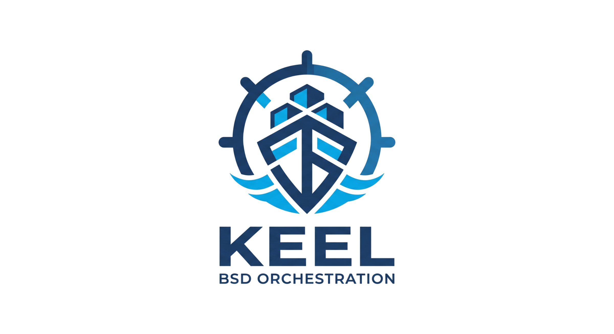

  

<h1 align="center">Keel</h1>

<em>Declarative, self-healing orchestration for FreeBSD jails.</em>

  <a href="#why-freebsd">Why FreeBSD</a> ·
  <a href="#how-this-differs-from-kubernetes">vs. Kubernetes</a> ·
  <a href="#the-journey-so-far">History</a> ·
  <a href="#roadmap">Roadmap</a>

---

Keel (named kubsd during its first four milestones) is a Kubernetes-style
orchestration platform for FreeBSD, built on jails, ZFS, and VNET
networking.

## Motivation

FreeBSD has mature, battle-tested primitives for isolation and resource
control: jails, ZFS snapshots/clones, `rctl(8)` resource limits, VNET
per-jail networking. What it lacks is something that ties them together
the way Kubernetes ties together Linux namespaces, cgroups, and overlay
networking.

Existing FreeBSD jail tools (`bastille`, `ezjail`, `cbsd`, plain
`jail.conf`) are good at *creating* jails, but none of them are
*reconciliation-based*: none continuously watch a declarative spec and
drive the live system to match it, restart what crashed, clean up what was
removed, or survive their own restarts without losing track of what they
manage. That gap, declarative, self-healing orchestration for FreeBSD, is
what Keel is for.

## Why FreeBSD

Jails, ZFS, and VNET are not bolted-on features; they're core, long-lived
parts of the base system. That means Keel can be a comparatively thin
layer: most of what a container orchestrator normally has to build
(copy-on-write filesystem layers, resource accounting, network namespace
isolation) is already correct and well-tested at the OS level.

## How this differs from Kubernetes

Keel borrows Kubernetes' *shape* (declarative specs, a reconciliation
loop, a CLI that will mirror `kubectl`) but it is not trying to be a
drop-in replacement, and today it is far smaller in scope:

| | Kubernetes | Keel (current) |
|---|---|---|
| Workload unit | Pod (Linux containers) | Jail |
| Isolation | namespaces + cgroups | jails + `rctl(8)` |
| Filesystem | overlay/container images | ZFS clones of a base dataset |
| Networking | CNI, overlay networks, Services | VNET + `epair(4)` + `bridge(4)`, static IPs |
| Scope | multi-node cluster, resource-aware scheduler | multi-node, resource-aware scheduler (heuristic, no admission guarantee) |
| Control plane | API server + etcd + scheduler | node registry + resource-aware scheduler + spec routing |

In other words: what exists today spans a **kubelet** plus a thin
multi-node control plane with a resource-aware scheduler (headroom-based
placement by CPU/memory, node registry, routing a spec to a node either
automatically or by name), not a full cluster. There is no cluster
networking yet; see [Roadmap](#roadmap) below.

## Why you'd use it

- **Declarative jails.** Describe a jail (image, command, resources,
  network, restart policy) as a spec; apply it; the daemon makes reality
  match it, continuously, not a one-shot script.
- **Self-healing.** Crashed jails restart automatically per policy, with
  crash-loop backoff so a persistently broken jail doesn't spin forever.
- **Safe by construction.** The daemon only ever touches jails it created
  (name-prefixed and tracked in its own state), so it can share a host with
  other jails or tooling without stepping on them. State is crash-safe:
  killing the daemon or the whole VM never leaves it confused about what it
  manages.
- **Fast provisioning.** Jail root filesystems are ZFS clones of a base
  image, so creating a new jail is close to instant and cheap on disk.

## The journey so far

Keel is being built one milestone at a time: design a spec, write an
implementation plan, execute it task by task with a review after every
task, then a whole-branch review before moving on. Every FreeBSD-specific
behavior is verified on a real FreeBSD 15.1 VM, not assumed, before it's
locked into a plan.

### Milestone 1: `keel-spec`, the jail spec language

The foundation: a YAML schema for describing a jail (image, command,
network, resources, restart policy) plus the parsing and validation that
turns YAML into a typed `JailSpec`. This is where the core invariants of
the whole system were decided: what counts as a valid jail name, how
`cpu`/`memory` strings get parsed into concrete limits, which fields are
allowed to change on a re-apply and which are immutable for the life of
the jail, and how CIDR addresses are validated. Thirteen unit tests plus
four end-to-end tests, all running on any OS, no FreeBSD required.

### Milestone 2: `keel-jail` and `keel-zfs`, talking to the OS

The first milestone that actually touches FreeBSD. Two crates, each
built around the same pattern that carries through the rest of the
project: a trait describing what the crate does (`JailRuntime`,
`ZfsManager`), an in-memory `Fake` implementation for fast tests on any
machine, and a real implementation that shells out to `jail(8)`,
`jexec(8)`, `rctl(8)`, and `zfs(8)` on FreeBSD.

Getting the real implementations right took real hardware: `is_running`
first miscounted zombie processes as "running" until tested against an
actual jail; `ps` invocation syntax that looked right on paper didn't
parse the way FreeBSD expected; a `zfs snapshot` race under parallel
tests had to be made tolerant of losing that race rather than erroring.

### Milestone 3: `keel-net`, VNET networking

Adds `keel-net` and its `NetManager` trait: creating bridges, attaching
a jail to one over an `epair(4)` pair with a static address, and tearing
that down again. This milestone is also where `keel-jail::create`
gained a `vnet` parameter, since VNET-enabled jails need to be created
differently from the start, an early breaking change caught before it
could compound. By this point the "verify on the real VM before writing
the plan" discipline was fully in place, and Milestone 3 shipped with
zero fix rounds across all five of its tasks.

### Milestone 4: `keel-agentd`, the reconciliation core

The milestone that ties everything together. `Reconciler<J, Z, N>` is
generic over the three runtime traits from Milestones 1 through 3, so it
can be instantiated against the `Fake*` implementations for fast,
FreeBSD-free testing today, and against the real `Process*`/`Cli*`
implementations once a later milestone wires it up to an actual daemon.

Its public API is small on purpose: `new`, `apply`, `delete`,
`reconcile`. Underneath, seven tasks built it up in layers: a
`JailRecord` with the naming and path derivation rules (jail names,
dataset paths, epair names), a crash-safe state store that writes to a
temp file and renames rather than risking a torn write, a per-jail
`BackoffState` (starts at one second, doubles up to a five-minute cap,
resets after sixty seconds of stable uptime), the provisioning path with
automatic rollback on partial failure, and finally the public
`reconcile()` that runs the whole desired-versus-observed diff for every
jail in one pass, returning a list of per-jail failures so one broken
jail never blocks the others from being reconciled.

This was also the milestone where the review discipline paid for itself
most visibly. Three real bugs were caught, not by the first pass of
tests, but by treating every review (per-task, then a final whole-branch
pass on top) as a genuine adversarial check rather than a formality:

- `delete()` assumed that tearing down a jail, its dataset, and its
  resource limits were all safe to call on something that was never
  actually created, matching how network detach already behaved. Only
  the network side turned out to be built that way; the others needed
  the same tolerance added explicitly, for the real case of deleting a
  jail that was applied but never got as far as being provisioned.
- A test for crash-loop restart asserted that a jail would restart with
  zero elapsed time, but the backoff cooldown from the initial
  provisioning was, correctly, still armed at that instant. The bug was
  in the test's timing, not the reconciler.
- The final whole-branch review caught a real one: a failed restart
  attempt never armed the backoff cooldown at all, because the code
  returned early on error before reaching the line that would have
  armed it. Successful restarts were protected; failing ones, exactly
  the crash-loop case backoff exists for, were not. Fixed with a
  regression test that injects a restart failure and proves the cooldown
  now engages.

Milestone 4 finished at 71 tests, all passing, all still running without
touching FreeBSD.

### Milestone 5: local HTTP API + `keelctl`, wired to the real system

The first milestone where `keel-agentd` actually runs: a binary that wires
the real `ProcessJailRuntime`/`CliZfsManager`/`ProcessNetManager`
implementations into a `Reconciler`, drives it on a 5-second timer, and
serves `apply`/`get`/`delete` over a local HTTP API on a `0600` Unix
socket, plus `keelctl`, the companion CLI. A single worker thread owns the
`Reconciler` exclusively; the HTTP server and timer only ever reach it
through a command channel, so apply/delete take effect immediately
(reconciled before the caller's response) without introducing a second
concurrent owner. Everything is still hand-rolled and dependency-light,
in keeping with the rest of the project: a small HTTP/1.1 parser
(`httparse`) over a blocking `UnixListener`, YAML wire bodies reusing the
spec's existing `serde_yaml`, no async runtime.

Milestones 1-4 were tested entirely against fakes; Milestone 5's FreeBSD
VM verification was the first time the whole stack ran against the real
system end-to-end, and it promptly found two real bugs that no
fake-backed test could have caught, both in code shipped since
Milestone 2:

- `keel-jail`'s `destroy` only ran `jail -r`, never reaping the process
  `start_command` had spawned into the jail. The kill left a zombie
  holding a reference into the jail's rootfs mount, so an immediately
  following dataset teardown failed with "device busy" — exactly the
  sequence `Reconciler::delete` runs on every deletion of a jail with a
  running command. Fixed by tracking spawned children per jail name and
  blocking-waiting on only the destroyed jail's own children.
- Independently, even with that fixed, `zfs destroy` could still fail
  with "dataset is busy" for a brief window after `jail -r` returns — a
  real kernel-level mount-release timing gap, reproducible from a plain
  shell with no Rust involved. Fixed with a short bounded retry, the same
  pattern already used for `clone_from_base`'s snapshot race.

Milestone 5 finished at 96 tests on macOS, plus a clean 5-for-5 real
`apply → running → delete` cycle against actual jails, ZFS clones, VNET
networking, and `rctl` limits on the FreeBSD VM.

### Milestone 6: `rc.d` service integration + end-to-end smoke test

The milestone that turns `keel-agentd` from "a binary you run in a
terminal" into a real FreeBSD system service, closing out sub-project 1.
No new code was needed for daemonization itself: an `rc.d` script wraps
the unchanged Milestone 5 binary with the base system's `daemon(8)`
utility, using `-r` for restart-on-crash and `-S` to route its output to
syslog. The only Rust changes were two `eprintln!` call sites (daemon
startup, per-jail reconciliation failures) — no logging framework, no
`daemonize`/`signal-hook` dependency, no custom `SIGTERM` handler, since
the existing "jails outlive the daemon" design already makes the default
terminate-on-signal behavior correct. A committed smoke test script
(`scripts/smoke-test.sh`) proves the whole lifecycle end-to-end: install,
start, apply a real spec, kill `keel-agentd` directly to simulate a crash,
confirm both the automatic restart and correct state recovery with no
duplicate jail, stop the service and confirm the jail keeps running, clean
teardown.

One design subtlety mattered before any code was written: `daemon(8)`
takes two different pidfile flags, and combining `-r` with the wrong one
(`-p`, the child's pid) means `service ... stop` kills the child directly
while `daemon(8)` is still watching and immediately restarts it — the stop
command would silently do nothing. Verified directly on the VM before
committing to the design; the rc.d script uses `-P` (the supervisor's own
pid) throughout.

Full VM verification surfaced two more real bugs, neither reachable by
any fakes-backed test, since both are genuine OS/supervisor-interaction
characteristics that only exist under a real `daemon(8)`-supervised run:

- `keel-jail`'s `start_command` spawned the jailed process with Rust's
  default stdio inheritance, so a long-running jail held `keel-agentd`'s
  own stdout/stderr open. Under `daemon(8) -S`, those are the write end of
  a pipe `daemon(8)` reads to detect (via EOF) that `keel-agentd` itself
  died and needs restarting — an inherited pipe held open by the jailed
  workload meant `daemon(8)` silently never restarted a killed
  `keel-agentd` whenever any jail with a running command was active.
  Root-caused on the VM with `procstat -f`, showing the jailed process's
  fd 0/1/2 as a pipe shared with `daemon(8)`'s own relay pipe; fixed by
  giving the jailed process its own `/dev/null` stdio.
- The smoke test's own "jails outlive the daemon" check was a permanent
  false negative: `jls`'s default columns never include the jail's name,
  only its dataset path, so `grep`-ing for the name-prefixed string could
  never match regardless of whether the jail was actually still running.
  Fixed with a direct `jls -j <name>` lookup instead.

Milestone 6 finished at 97 tests on macOS (96 plus one new regression test
pinned to the exact stdio-leak mechanism via `procstat`), plus two
consecutive clean end-to-end smoke test runs on the FreeBSD VM.

### Milestone 7: `keel-controlplane`, the node registry

The first milestone of sub-project 2 (the multi-node control plane),
deliberately scoped to answer only "which nodes exist, and are they
alive" — no scheduling, no placement, no spec-forwarding, all of which
stay separate future sub-projects. A new crate, `keel-controlplane`,
follows the exact same shape `keel-agentd` already established: a single
worker thread exclusively owns an in-memory `Registry`, reachable only
through an `mpsc` command channel, fronted by the same hand-rolled
`httparse`-based HTTP server `keel-agentd` uses for its local API — just
over a `TcpListener` instead of a Unix socket, since nodes live on
separate hosts. Three endpoints: register a node, heartbeat a node, list
all nodes with their liveness computed on read (`Alive` within 15
seconds of the last heartbeat, `Dead` after) rather than tracked by a
background sweep.

`keel-agentd` gained three new, entirely optional CLI flags
(`--node-id`, `--control-plane-addr`, `--advertise-addr`) and a
`registration.rs` background thread: register once at startup, heartbeat
every 5 seconds, and treat *any* heartbeat failure — a rejected/unknown
node or a connection error — identically, by simply re-registering on
the next tick. There is deliberately no persistence anywhere in this
milestone and no backoff: a control plane that restarts forgets every
node, and every node notices and re-registers within one heartbeat
interval, the same self-healing-over-durability bet the reconciler
already made in Milestone 4, just applied to cluster membership instead
of jail state.

One constraint surfaced only once tests were being written, not before:
the design assumed an in-process test could simulate "the control plane
restarts" by dropping a `TcpListener` and rebinding a fresh one to the
same address. Verified directly that this doesn't work —
`std::net::TcpListener::bind` fails with "Address already in use" as
long as the original socket is still alive and listening in another
thread, regardless of `SO_REUSEADDR`. That specific behavior — the one
genuinely OS-level part of this milestone — was verified for real
instead, against three separate FreeBSD VMs: all three nodes registered
and showed `Alive` within one heartbeat interval; killing `keel-agentd`
on one node flipped only that node to `Dead` after the 15-second
threshold, the other two unaffected; restarting `keel-controlplane`
emptied the registry (`[]`), and both surviving nodes' own logs showed
the expected `heartbeat failed: control plane returned status 404` →
re-register cycle, landing back at all-`Alive` within about one
heartbeat interval with neither node process ever restarted.

Milestone 7 finished at 122 tests on macOS (96 inherited, 26 new across
`keel-controlplane`'s registry/worker/http layers and `keel-agentd`'s new
CLI flags and registration client), zero warnings, final whole-branch
review clean with no Critical or Important findings.

### Milestone 8: routing jail specs to a specific node

The second milestone of sub-project 2, and the one that completes the
multi-node control plane: given the node registry from Milestone 7, a
client can now apply, get, or delete a `JailSpec` on a specific, named
node by routing the request through `keel-controlplane`, rather than
connecting to that node's `keel-agentd` directly. The caller always
names the exact node; there is still no scheduler and no bin-packing,
that stays a separate, not-yet-designed future sub-project.

`keel-controlplane` gained `Registry::resolve` and four new HTTP routes
(`PUT`/`GET`/`DELETE /nodes/<id>/jails/...`) that forward a request
byte-for-byte over a fresh TCP connection to the resolved node's
`keel-agentd`, relaying the response back untouched. It never
deserializes the spec body, and gained no new dependency on `keel-spec`
or `keel-agentd`'s wire types. Unknown or `Dead` nodes are rejected
before any connection is attempted, not after a timeout. `keel-agentd`
gained a second, entirely optional TCP listener serving the exact same
jails API already served by its Unix socket, bound to `--advertise-addr`
(whose contract changes from Milestone 7's undialed display string to a
real, dialable `host:port`) only when the Milestone 7 control-plane
flags are set; the Unix socket itself is completely unchanged. `keelctl`
gained `--control-plane-addr`/`--node` flags to route through the
control plane; omitting both preserves its exact prior behavior.

VM verification found and fixed a real, if minor, test-only bug: a test
helper added for the forwarding routes read an incoming request with a
single, non-looping socket read, while the real forwarding code sends it
as two separate writes before shutting down its write half. Under load
that could leave unread bytes queued when the test helper's stream was
dropped, and a BSD-derived TCP stack can turn that into a spurious reset
instead of a clean close. Fixed by draining reads to EOF before
responding.

The VM run also turned up two real, pre-existing product bugs, both
invisible to any fakes-backed test and both the same underlying gap:
neither `keel-jail`'s `ProcessJailRuntime::destroy` nor `keel-zfs`'s
`CliZfsManager::destroy_dataset` ever mapped a "doesn't exist" failure
to the `NotFound` error variant `Reconciler::delete`'s Milestone 4
tolerance already expects, so deleting a jail record whose provisioning
failed before it was ever created (a scenario that had simply never
come up in five prior milestones of VM testing) failed outright instead
of succeeding as a no-op. Fixed in both crates by matching the real
command's own "not found" stderr text, the same idiom already used
elsewhere in each file, verified with new FreeBSD-only regression tests
and a direct end-to-end reproduction of the original failure.

Milestone 8 finished at 139 tests on macOS (122 inherited, 17 new across
`keel-controlplane`'s forwarding layer, `keel-agentd`'s TCP listener, and
`keelctl`'s routed mode), final whole-branch review clean, and full VM
verification across three real nodes: a spec applied to one specific
node landed there and nowhere else, routed `get`/`delete` worked,
unknown-node and dead-node targets were rejected with clear errors
before any connection attempt, and plain single-node `keelctl` usage
stayed completely unaffected throughout.

### Milestone 9: scheduler, automatic node placement

The first milestone of sub-project 3, and the one that finally answers
"which node does an unscheduled jail land on": given the node registry
and node-forwarding from Milestones 7-8, a client can now apply, get, or
delete a `JailSpec` without naming a node at all. `keel-controlplane`
gained a new in-memory `Placements` table (`jail_name -> node_id`), owned
by the same single worker thread that already owns the node `Registry`,
and a pure `scheduler::pick_node` function: among `Alive` nodes, pick the
one with the fewest jails currently recorded in `Placements`, ties
broken by ascending node id. Placement is by jail count only, not real
CPU/memory pressure, since nodes report no capacity today; teaching them
to is future work, if it's ever needed.

Three new routes, `PUT`/`GET`/`DELETE /jails/<name>` (no node segment in
the path), sit alongside Milestone 8's unchanged
`/nodes/<id>/jails/<name>` routes, which now also update the same
`Placements` table on success, so jail counts and lookups stay
consistent no matter which route family placed a given jail. Applying an
already-placed jail is sticky, forwarding to the same node it originally
landed on rather than re-scheduling; a jail whose recorded node has
since gone `Dead` is never silently rescheduled elsewhere, it surfaces
the same `Dead` error a named-node route already gives, and a human can
still explicitly repin it via the named route. `keelctl`'s `--node` flag
became optional: `--control-plane-addr` alone now means "schedule it,"
while `--control-plane-addr --node <id>` keeps Milestone 8's exact-node
behavior unchanged.

Milestone 9 finished at 161 tests on macOS (139 inherited, 22 new across
`keel-controlplane`'s `Placements`, `scheduler`, `worker`, and `http`
layers), final whole-branch review clean, and full VM verification
across three real nodes: applying two differently-named specs with no
`--node` landed them on two different nodes, re-applying one of them
kept it on its original node even after a third, emptier node joined,
and plain named-node `keelctl` usage stayed completely unaffected
throughout.

### Milestone 10: resource-aware bin-packing

The second milestone of sub-project 3: the scheduler introduced in
Milestone 9 picked a node by jail count alone; this milestone teaches it
to consider actual CPU and memory instead. `keel-agentd` detects its own
capacity once at startup via `sysctl -n hw.ncpu`/`sysctl -n hw.physmem`
(the same shell-out idiom already used for `jail(8)`/`zfs(8)`), reports
it once at registration, and reports its currently committed load, the
sum of `spec.resources.{cpu,memory}` across every jail its own
`Reconciler` tracks, on every heartbeat. `keel-controlplane`'s
`scheduler::pick_node` now ranks `Alive` nodes by
`min(free_cpu/capacity_cpu, free_memory/capacity_memory)`, the fraction
of headroom in whichever resource is most constrained, rather than by
jail count, while remaining completely opaque to `JailSpec` bodies: it
never learns a node's numbers by parsing a spec, only by the node
self-reporting its own aggregate totals.

This is a ranking heuristic, not admission control: the scheduler never
sees an incoming jail's own resource request, since that would require
deserializing the spec, which stays off-limits, so it can't guarantee a
chosen node actually has room. A node that turns out unable to fit a
jail simply fails that apply normally, the same honest limitation
Milestone 9's count-based version already had.

Milestone 10 finished at 171 tests on macOS (161 inherited, 10 new
across `keel-agentd`'s new `capacity` module and
`Reconciler::committed_resources`, and `keel-controlplane`'s wire,
registry, scheduler, worker, and http layers), final whole-branch review
clean, and full VM verification across three real nodes: detected
capacity matched direct `sysctl` queries exactly; a large jail
committing most of one node's capacity landed there first (both nodes
tied at registration), and a second, smaller jail then correctly landed
on the other node, the one with more headroom fraction rather than fewer
jails; sticky re-apply and named-node routing stayed completely
unaffected throughout.

### Milestone 11: control-plane shared-secret authentication

Milestones 7-10 built the multi-node control plane under a trust model each
of those milestones' specs stated explicitly: same-network trust assumed,
hardening deferred. Concretely, anyone who could reach
`keel-controlplane`'s TCP port or a `keel-agentd`'s opt-in
`--advertise-addr` listener could register a fake node, spoof another
node's heartbeat, or apply/delete a jail on any node, with no credential
of any kind. This milestone closes that gap for authorization, not yet
for confidentiality: a single shared cluster secret, generated once by the
operator and distributed as a file to every host, is now required on
every request `keel-controlplane` and `keel-agentd`'s TCP listener serve,
checked via a hand-rolled constant-time comparison (no new dependency) at
a single choke point in each crate's `route()`. Every outbound call this
project already makes, `keel-agentd`'s registration/heartbeat, and
`keel-controlplane`'s forwarding to a node, attaches the same token.
`keel-agentd`'s Unix socket keeps its original, unwrapped `route()` and is
completely untouched: its `0600`-permission trust boundary was never the
gap this milestone exists to close. TLS/wire encryption is deliberately
out of scope here, a separate future milestone; this one stops an
unauthenticated actor from issuing commands, not a sophisticated on-path
eavesdropper from reading the wire.

`keel-controlplane`, `keel-agentd`, and `keelctl` each gained a new
`--auth-token-file <path>` flag: unconditionally required on
`keel-controlplane` (it has no non-networked mode at all), and required
alongside the existing control-plane flags on `keel-agentd`/`keelctl`
(extending the pairing check Milestone 7 already established for
`--node-id`/`--advertise-addr`), plain single-node usage of either
binary is entirely unaffected.

Milestone 11 finished at 208 tests on macOS (191 inherited, 17 new across
both crates' `auth` modules and the HTTP/registration/CLI wiring), and
full VM verification across three real nodes: all three registered
`Alive` against an authenticated `GET /nodes`; a scheduled apply/get/delete
round trip succeeded end-to-end with auth in place; a `keelctl` call with
a missing token file failed locally without ever reaching the network,
and one with a wrong-but-present token reached the control plane and got
a generic `401`; a node restarted with a stale, mismatched token repeated
`registration failed: control plane returned status 401` every heartbeat
and never appeared `Alive` until its token file was corrected; clean
teardown confirmed on all three VMs afterward.

### Milestone 12: mutual TLS for the control plane

Milestone 11's shared-secret token closed the authorization gap but left
two things on record as its own stated limitations: no confidentiality
(an eavesdropper on the LAN could still read the token and every spec
body in flight), and no per-identity credential (one leaked token
compromised the whole cluster, with no way to revoke just one node's or
operator's access). This milestone replaces the token entirely with
mutual TLS: every connection, client to control plane, node to control
plane, control plane to node, is encrypted, and identity is proven by a
certificate signed by a private CA the operator generates once, not by a
string copied to every host. It is this project's first genuinely new
runtime dependency, `rustls` pinned to its `ring` crypto backend
(`default-features = false, features = ["ring"]`) rather than the
default `aws-lc-rs`, since the latter is C/assembly and would add a
build-toolchain requirement this project has never had; certificate
*generation* itself stays entirely in a new `scripts/gen-certs.sh`
shelling out to `openssl`, not a new Rust dependency.

Every accepted connection is wrapped in a real TLS handshake requiring
and verifying a client certificate before any HTTP request is parsed,
which let Milestone 11's `auth::check` calls, and `keel-agentd`'s
`route`/`route_authenticated` split, disappear entirely: identity is now
proven at the transport layer, so `route()` itself needs no
auth-awareness at all, on either the Unix-socket or TLS-wrapped path.
`keel-agentd`'s Unix socket keeps calling that same, now-simpler
`route()` unwrapped, exactly as it always has. One certificate per node
(and one for the control plane itself, issued the identical way) doubles
as both a TLS server certificate, when it's dialed, and a client
certificate, when it dials out, matching the "one identity, no
artificial split" principle `node-id` already embodied everywhere else.

Milestone 12 finished at 202 tests on macOS (191 inherited from
Milestone 11, minus the deleted `auth` modules' tests, plus new coverage
across three `tls` modules and the HTTP/registration/CLI TLS wiring), and
full VM verification across three real nodes: all three registered
`Alive` against an authenticated `GET /nodes` over real mTLS; a scheduled
apply/get/delete round trip succeeded end-to-end with real client
certificates; a `keelctl` call with a missing certificate file failed
locally without ever reaching the network; clean teardown confirmed on
all three VMs afterward.

Three real bugs surfaced only once the whole pipeline was exercised
together, none caught by any single crate's own test suite in isolation.
Twice, a read loop added to tolerate `rustls`'s `UnexpectedEof` (its
documented behavior for a TLS peer that closes without a `close_notify`
alert) was copied without the accompanying `Content-Length` cross-check
that makes the tolerance safe, letting a connection cut short be
silently accepted as a complete response instead of erroring; one
instance (`keel-controlplane`'s own node-forwarding path) was genuinely
exploitable, the other (`keelctl`'s own response to the operator's
terminal) was worse, since the truncated body is exactly what a human
would see as if it were correct. Third, a cross-crate crypto-provider
conflict: `keel-controlplane::tls` and `keel-agentd::tls` each guard
`rustls`'s one-time crypto-provider install with their own crate-local
`Once`, and linking both into one test binary (Milestone 12's own
integration tests do exactly this) meant the second crate's first-ever
call saw `rustls`'s ordinary "already installed" `Err` and turned it into
a panic instead of ignoring it, the same "ignore the outcome of losing
the race" idiom `rustls`'s own internal helper already uses for this
exact case.

VM verification also turned up a real, if mundane, testing artifact: a
committed test fixture certificate, generated on a different machine
than the one it was later checked against, carried a `notBefore` field
set relative to its own clock, which the verifying VM's clock hadn't
reached yet, since VMs and their build hosts don't share a clock. `rustls`
correctly rejected the not-yet-valid certificate, just not for the
untrusted-issuer reason the test intended to demonstrate, standing
proof that generating any TLS test fixture across a machine boundary
carries an inherent, if usually small, clock-skew risk.

## Roadmap

**Sub-project 1: single-node jail reconciliation daemon (complete)**

1. ~~FreeBSD dev environment + jail spec language (parsing, validation)~~ done
2. ~~Jail lifecycle (`jail(8)`/`jls(8)`/`rctl(8)`) and ZFS clone provisioning~~ done
3. ~~VNET networking (`epair(4)` + `bridge(4)` wiring)~~ done
4. ~~Reconciliation core (desired vs. observed state, crash-loop backoff, crash-safe persistence), tested against fakes~~ done
5. ~~Local HTTP API + CLI, wired to the real jail/ZFS/net implementations~~ done
6. ~~`rc.d` service integration and an end-to-end smoke test on the FreeBSD VM~~ done

**Sub-project 2: multi-node control plane (complete)**

7. ~~Node registry: `keel-controlplane`, register/heartbeat/list over TCP, self-healing membership~~ done
8. ~~Routing jail specs to a specific node through the control plane~~ done

**Sub-project 3: scheduling and cluster growth (complete)**

9. ~~Scheduler: automatic node placement by jail count, sticky on re-apply~~ done
10. ~~Resource-aware bin-packing: node-reported CPU/memory capacity and committed load, headroom-based placement~~ done

**Sub-project 4: control-plane hardening (in progress)**

11. ~~Shared-secret authentication on every control-plane and node TCP route~~ done
12. ~~Mutual TLS between client, control plane, and nodes, replacing the shared secret~~ done
13. Certificate revocation and rotation automation (not yet designed)

**Not yet designed** (future sub-projects, each will get its own spec):

- Cluster networking (cross-node overlay, service discovery/load balancing)
- Storage orchestration beyond a single host's ZFS pool
- bhyve VM workloads alongside jails

## Platform support

FreeBSD only. No plans to support other BSDs (NetBSD, OpenBSD) or Linux;
the design leans directly on FreeBSD-specific primitives (jails, `rctl`,
VNET, ZFS) rather than abstracting over multiple OSes.
